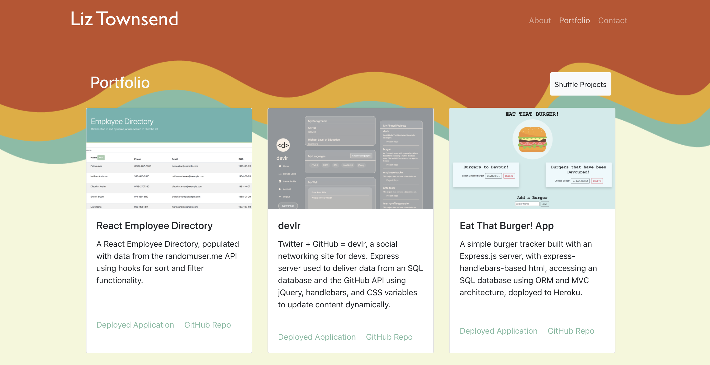
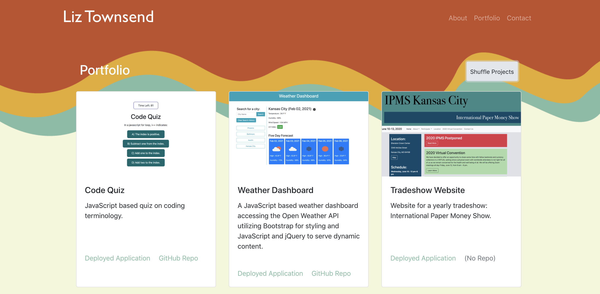

# React Portfolio

A single-page portfolio built with React. 

## The Code

The different pages are served with HashRouter from the <a href="https://www.npmjs.com/package/react-router-dom"> react-router-dom</a> npm package.

On the Portfolio page, the default state is to show 6 projects.

When the "Shuffle Projects" button is pressed, the array of projects is shuffled and the state is reset with 6 new projects:

## Deployment

The app is deployed at <a href="https://liztownd.github.io/react-portfolio/#/">https://liztownd.github.io/react-portfolio/#/</a>.
